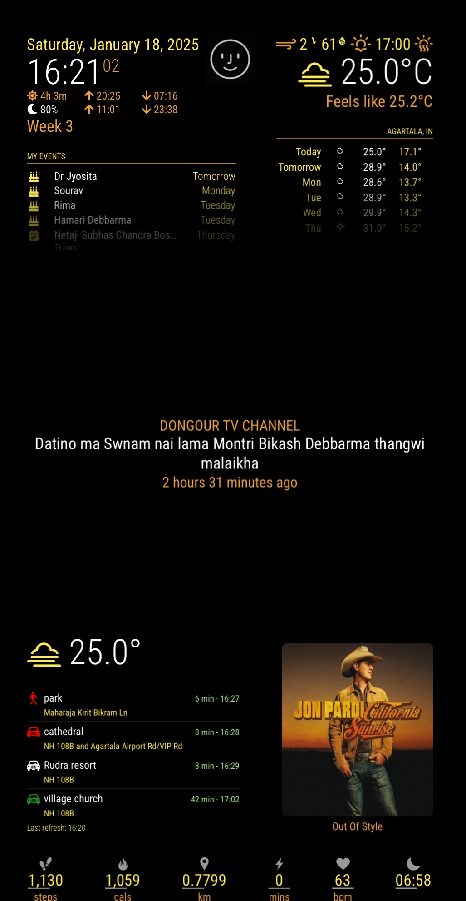
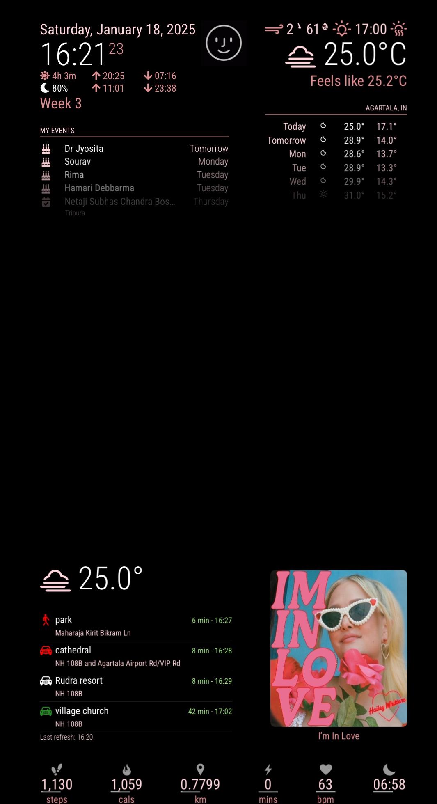
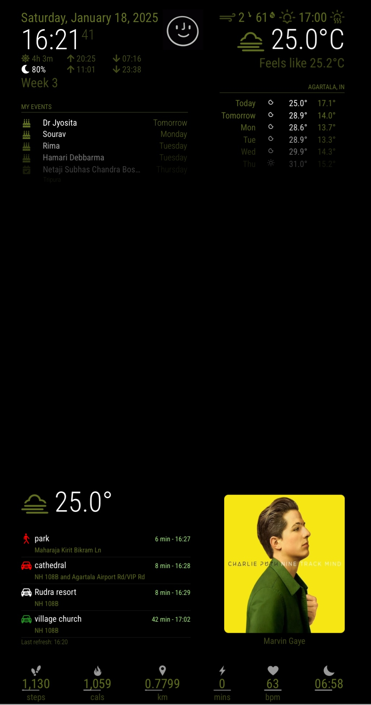

<p align="center">
  
  
  
</p>

# MMM-Shairportsync-color

MMM-Shairportsync-color is a MagicMirror module that dynamically updates MM theme of your MagicMirror display based on the dominant colors of the album art of the currently playing song. This is achieved by extracting the color palette from the album art and applying it to the MagicMirror interface. The module is designed to work in conjunction with [Shairport Sync](https://github.com/mikebrady/shairport-sync.git) with metadata enabled and relies on the [MMM-ShairportMetadata](https://github.com/sdmydbr9/MMM-ShairportMetadata.git) module for metadata integration. The module is inspired by [MMM-OnSpotify](https://github.com/Fabrizz/MMM-OnSpotify.git).

## Features

- Extracts the dominant color palette from album art in real-time.
- Dynamically updates text and theme colors on the MagicMirror interface.
- Adjustable brightness and overrides for specific text styles (dimmed, small, extra small).
- Seamless integration with Shairport Sync and MMM-ShairportMetadata.

## Prerequisites

1. **Shairport Sync**

   - Install Shairport Sync from [here](https://github.com/mikebrady/shairport-sync.git).
   - Enable metadata in Shairport Sync by adding the following to your configuration file:
     ```bash
     metadata = {
         enabled = "yes";
     };
     ```

2. **MMM-ShairportMetadata Module**

   - Install the MMM-ShairportMetadata module from [here](https://github.com/sdmydbr9/MMM-ShairportMetadata.git).

3. **Python Dependencies**

   - Ensure you have Python 3 installed.
   - Install the required Python libraries:
     ```bash
     pip3 install pillow colorthief
     ```

## Installation

1. Clone this repository into the `modules` directory of your MagicMirror setup:

   ```bash
   cd ~/MagicMirror/modules
   git clone https://github.com/sdmydbr9/MMM-Shairportsync-color.git
   ```

2. Navigate to the module directory:

   ```bash
   cd MMM-Shairportsync-color
   ```

3. Install the necessary dependencies:

   ```bash
   npm install
   ```

## Configuration

Add the following configuration to the `config.js` file of your MagicMirror:

```javascript
{
    module: "MMM-Shairportsync-color",
    position: "fullscreen_above", // Recommended placement
    config: {
        brightnessFactor: 1.0, // Adjust overall brightness (default: 1.0)
        paletteIndex: "primary", // Default color from the palette (options: primary, secondary, accent, highlight)
        brightnessOverrides: {
            dimmed: 1.2, // Brightness factor for dimmed text
            small: 1.4, // Brightness factor for small text
            extraSmall: 1.6 // Brightness factor for extra small text
        }
    }
}
```

### Configuration Options

| Option                | Type     | Default   | Description                                                             |
| --------------------- | -------- | --------- | ----------------------------------------------------------------------- |
| `brightnessFactor`    | `float`  | `1.0`     | Adjusts the overall brightness of the theme colors.                     |
| `paletteIndex`        | `string` | `primary` | Specifies the color from the palette to apply.                          |
| `brightnessOverrides` | `object` | `{}`      | Adjustments for specific text styles (e.g., dimmed, small, extraSmall). |

## How It Works

1. When Shairport Sync plays a song, it sends metadata (including album art) to MMM-ShairportMetadata.
2. This module receives the album art as a Base64-encoded image.
3. The album art is passed to a Python script, which extracts the dominant color palette using the `ColorThief` library.
4. The extracted color palette is sent back to the frontend, where it updates the MagicMirror's theme dynamically.

## Examples

Here are some examples of the module in action:

### Example 1


### Example 2


### Example 3


## File Structure

- **main.js**: Handles the frontend logic, including applying the color palette to the interface.
- **node\_helper.js**: Processes the album art using a Python script and communicates with the frontend.
- **color\_palette\_extractor.py**: Python script to extract the dominant color palette from the album art.

## Development

### Running in Debug Mode

You can view detailed logs by starting MagicMirror in server mode:

```bash
npm start dev
```

### Modifying the Module

Feel free to customize the module by editing the following files:

- `main.js`: Modify frontend behavior and CSS injection logic.
- `node_helper.js`: Adjust backend processing and Python integration.
- `color_palette_extractor.py`: Enhance or customize the color extraction logic.

## Credits

- **Shairport Sync**: By Mike Brady
- **MMM-ShairportMetadata**: By sdmydbr9
- **MMM-OnSpotify**: By Fabrizz

## License

This project is licensed under the MIT License. See the `LICENSE` file for details.

